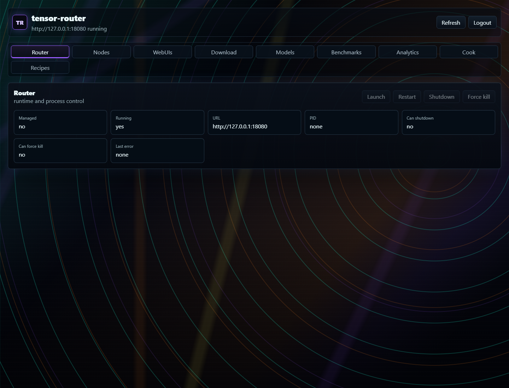
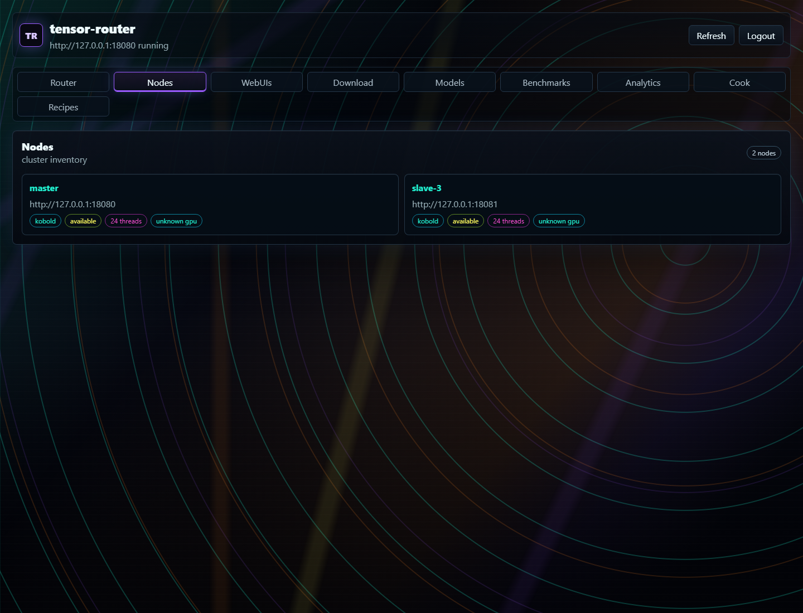
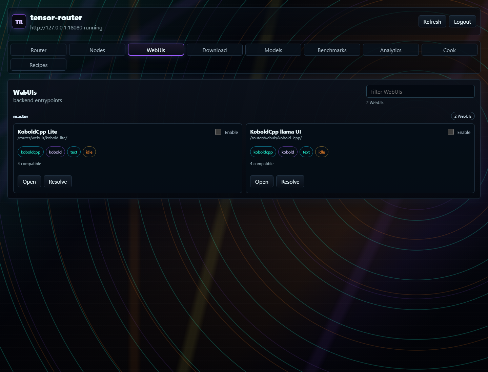
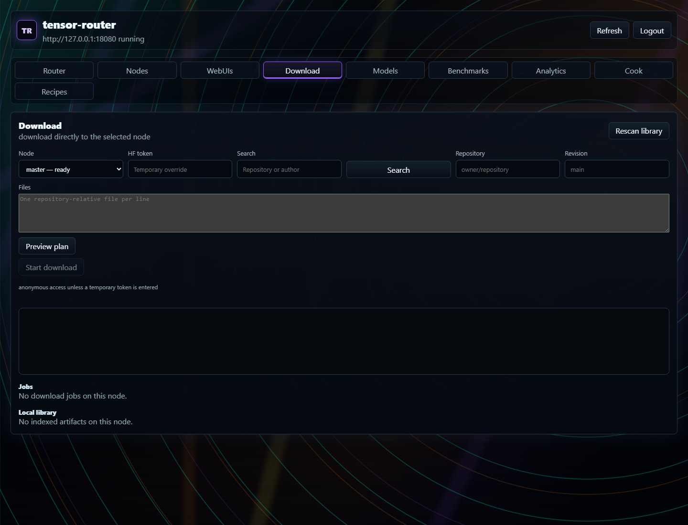
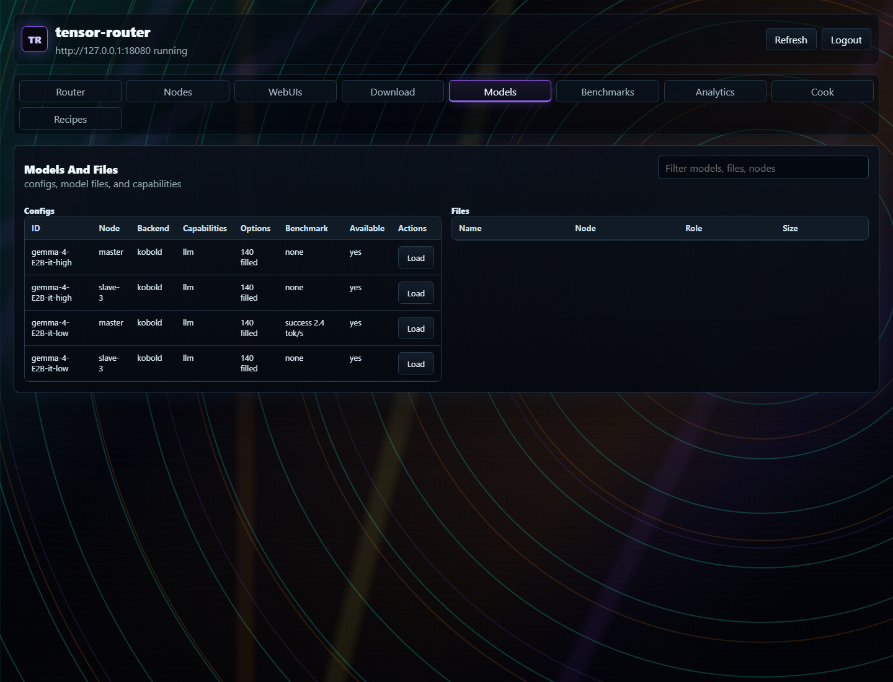
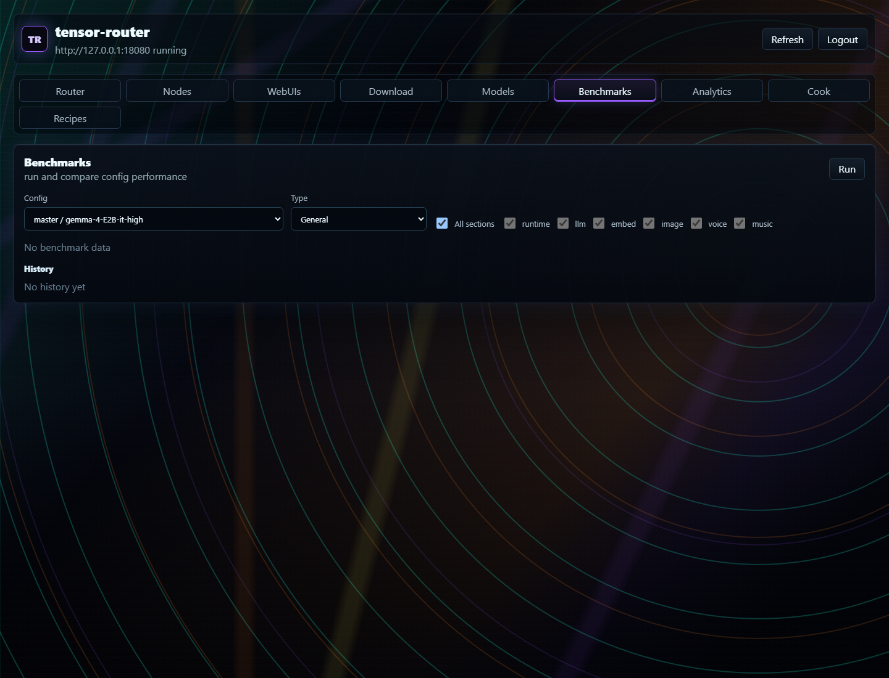
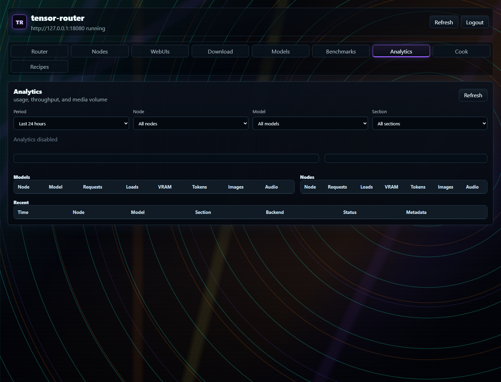
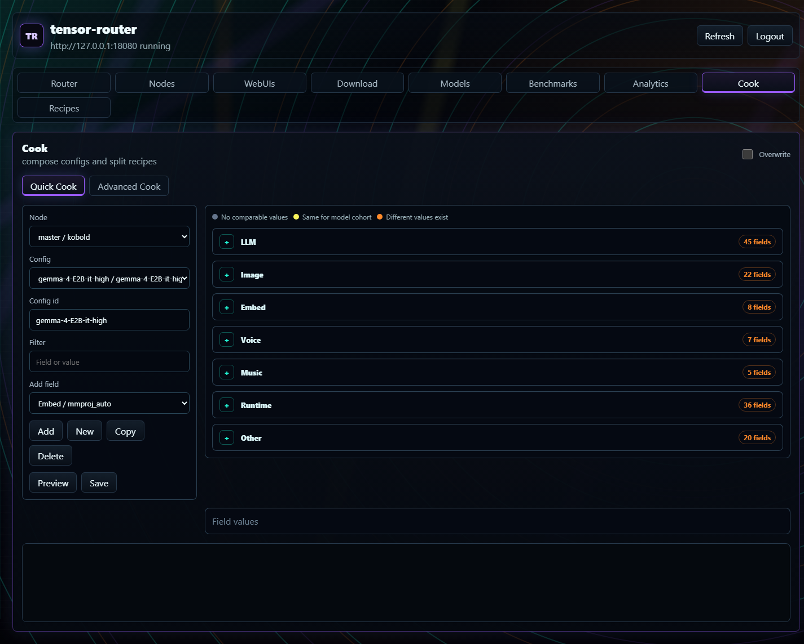
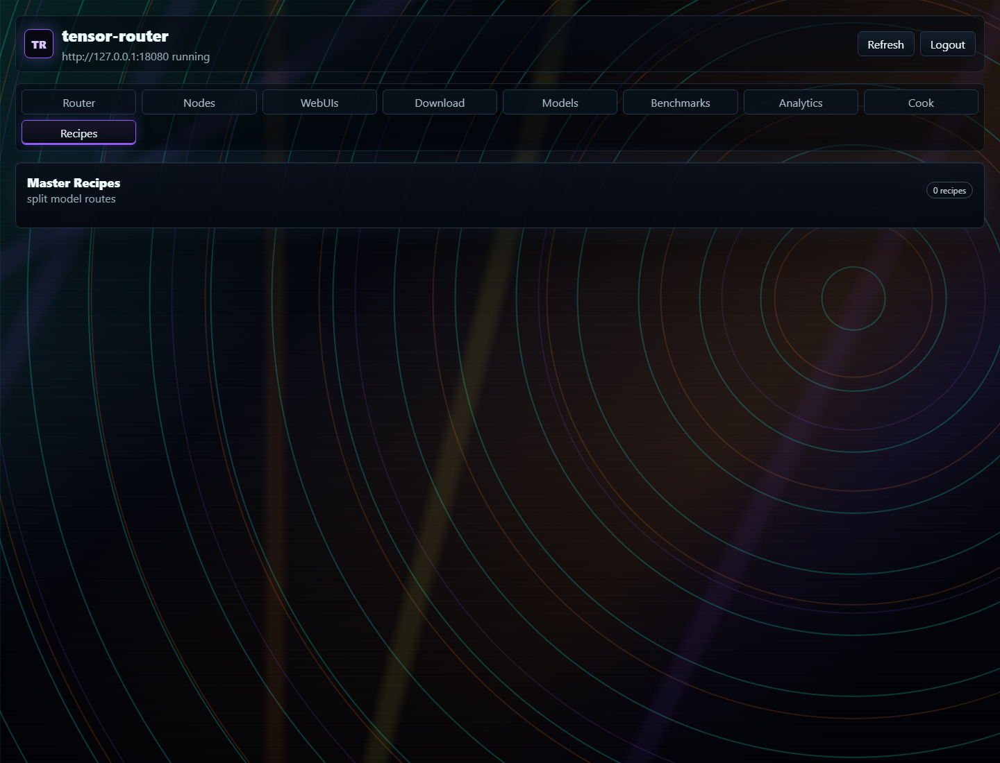

# tensors-router

`tensors-router` presents local AI software through one base URL and API surface, similar to the operating model of a cloud AI provider. Clients select a `.kcpps` model configuration, and the router starts, loads, switches, drains, and unloads the required text, image, embedding, voice, or music backend on the local machine or a cluster node. Users do not have to manage each backend process or switch model software by hand.

<table>
  <tr>
    <td></td>
    <td></td>
    <td></td>
  </tr>
  <tr>
    <td></td>
    <td></td>
    <td></td>
  </tr>
  <tr>
    <td></td>
    <td></td>
    <td></td>
  </tr>
</table>

## Run topologies

- Headless standalone: run the router without the management WebUI.
- WebUI-managed standalone: run the WebUI and let it start and stop the router process.
- Routing-only master: run a master with no local models and place all inference work on cluster nodes.

See [Run topologies](https://github.com/derijans/tensors-router/wiki/Run-Topologies) for configuration and commands.

## Backends

- [KoboldCpp](https://github.com/LostRuins/koboldcpp) provides a single managed process for supported text, image, embedding, voice, and music routes.
- [llama.cpp](https://github.com/ggml-org/llama.cpp) with [stable-diffusion.cpp](https://github.com/leejet/stable-diffusion.cpp) provides separate text and image processes that load independently.
- [vLLM](https://vllm.ai/) uses a separate resident companion with lazy generation, pooling, and speech runtimes. Runtime installation is explicit, isolated, signed-manifest-driven, and available only in supported Linux and Apple Silicon releases.

See [Backends](https://github.com/derijans/tensors-router/wiki/Backends) for supported routes, configuration mapping, and process behavior.

## Capabilities

- Queue-aware routing: Requests go to a free copy of the model first, and busy models can hand overflow work to another node.
- VRAM and model residency: Each node knows which models are in memory and how much VRAM they take. Unload policies decide which models are evicted when a new one needs room, and chosen models can stay resident side by side.
- Node failure during a request: Failed requests are retried and crashed backends are reloaded automatically.
- Duplicate model loading: A model is loaded once and shared by every request that needs it. Configs of the same model that differ only in `jinja_kwargs`, such as thinking on or off, share that loaded model, so switching between them costs no reload.
- Concurrent model switching: Clients can ask for different models at the same time. Requests for the loaded model run together, requests for another model wait their turn, and the switch happens only after running work finishes, so nothing is cut off.
- Node health: Unresponsive nodes are taken out of rotation until they recover, and failed local backends are restarted.
- Streaming failures: Failed streams are retried before output starts, and closing the client stops the backend work.
- Capacity weighting by model size: Big and small models are not treated as equal. Each node measures how long every model takes to load and to process tokens or image steps. When a queue builds up, those measurements decide whether moving work to another node, including loading the model there, finishes sooner than waiting.
- Metrics and observability: Optional analytics keep per-request timing, tokens, and VRAM use in SQLite. Load logs, load errors, and benchmarks are viewable in the WebUI.
- Security and authentication: Access is limited by IP range and separate keys for inference, admin, and cluster traffic. Backend updates are signature-checked.
- Heterogeneous hardware: Each node detects its GPU type (CUDA, ROCm, Vulkan, Metal, or CPU) and installs matching backend builds. One cluster can mix backends and operating systems.
- Backend integration: KoboldCpp, llama.cpp with stable-diffusion.cpp, and vLLM run behind one URL with OpenAI, Ollama, KoboldCpp, and A1111 APIs. Each model config can choose its own backend.

## Documentation

- [Wiki](https://github.com/derijans/tensors-router/wiki)
- [Getting started](https://github.com/derijans/tensors-router/wiki/Getting-Started)
- [Configuration](https://github.com/derijans/tensors-router/wiki/Configuration)
- [API reference](https://github.com/derijans/tensors-router/wiki/API-Reference)
- [Deployment](https://github.com/derijans/tensors-router/wiki/Deployment)
- [Testing and troubleshooting](https://github.com/derijans/tensors-router/wiki/Testing-and-Troubleshooting)
- [Releases](https://github.com/derijans/tensors-router/releases)
- [Router configuration example](config.example.yaml)
- [WebUI configuration example](webui.example.yaml)
- [Downloader configuration example](downloader.example.yaml)
- [License](LICENSE)

## Network scope

This router is intended for intranet use. Do not expose it directly to the public internet. Bind it to localhost or a private interface, restrict `server.allowed_cidrs`, and use a reverse proxy or VPN when remote access is required.

## Credits

Thanks to the maintainers and contributors of the backend projects used by `tensors-router`:

- [KoboldCpp](https://github.com/LostRuins/koboldcpp) provides the combined text, image, embedding, voice, and music backend.
- [llama.cpp](https://github.com/ggml-org/llama.cpp) provides the split text, embedding, multimodal, and supported audio backend.
- [stable-diffusion.cpp](https://github.com/leejet/stable-diffusion.cpp) provides the split image and video backend.
- [vLLM](https://vllm.ai/) provides the generation, pooling, and speech serving engine used by the optional companion backend.
